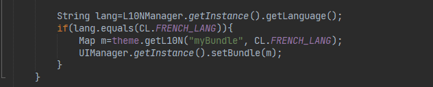
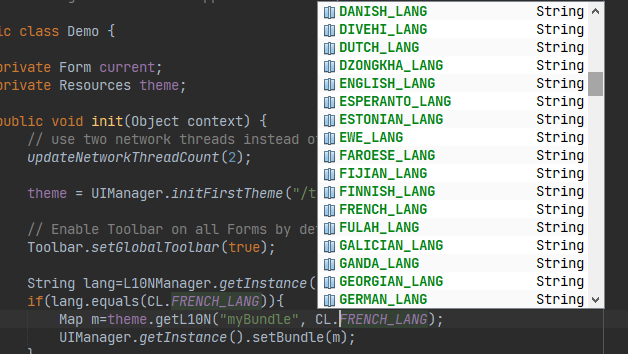

# Codename One Linguist

### Overview :
Codename One Linguist is a free desktop software and a Codename One library (CN1LIB) to internationalize/localize your Codename One mobile application. 
It's more friendly, simple and complete than the localization tool built into Codename One Designer. 
You can [download this app](https://github.com/ericlight/CN1Linguist/releases/tag/1.0) alone or download [CodenameOne Toolbox](https://ericlight.github.io/CN1Toolbox) which contains this tool and another tool ([CodenameOne Extensions](https://ericlight.github.io/CN1Extensions)).

### Features :
- Extract words from your Java source code files
- Translate your app in 186 languages
- Add translated words directly in your project resource file (commonly theme.res)
- Add translation keywords manually
- Import/Export translated contents from/to CSV, JSON and Java properties formats
- Sort keys and values by ascending and descending order
- Add and override predefined words/contents from Codename One UI components
- Duplicate your key to the value field
- Auto-saving after value modification and validation. Don't rely too much on auto-save so save manually (Ctrl-S) your modifications

### Roadmap :
- **Extract contents from UI built with the GUI Builder (Sync UI)**
- **Build a local database of frequently used words and translations in the app. It will help to find same words quickly**
- **Share your words and translations with others Codename One developers via the software**
- **Export translated words into Android Strings XML format**
- Build for Mac OS
- Build for Linux
- Dark theme for the user interface
- Translate the app in others languages - I need help for that because i can only speak french and english

### Requirements :
- Windows PC - I'am a Windows user so this [first release](https://github.com/ericlight/CN1Linguist/releases/tag/1.0) of Codename One Linguist is built for Windows. 
The source code is completely portable and cross-platform (written in C++/Qt) so if you are a Mac OS or Linux user, please clone the source code on GitHub and contribute by building it for Mac OS and Linux users. 
I can help you with some instructions to do it if you want. Check the Contributions section for more informations. Thanks :) 

- Codename One Linguist Library - You have to use this software with a CN1LIB. You can [download it here](https://github.com/ericlight/CN1Linguist/releases/download/1.0/CN1LinguistLib.cn1lib) or via Extensions with the Codename One Preferences window. Once downloaded, you have to add it in your project.

### How to use the library :
Once the [library downloaded and installed in your project](https://www.codenameone.com/blog/automatically-install-update-distribute-cn1libs-extensions.html), do the following things : 
- Surround all the words and contents that you want to translate later with the **tr()** method. It will help the Codename One linguist tool to extract those words automatically for you and all you have to do is to translate them within the software.

 method")

- To apply your translations to your app, you can do this in your project's **init()** method :

The first line will return the default language of your device. You can then compare this value with the language that you want to use and apply it on your app.

There are 186 languages available for you as a constants in the CL class. This constants are just the ISO-639 two letter code of these languages.

Check the video below to learn the entire translation process using the software. 

### Video tutorial :

### Author :
My name is Eric, i use Codename One to develop mobile apps since the beginning and i'am also the author of the first book (written in french) on Codename One. I still to believe this framework deserves more visibility and users so i decide to build complete and easy-to-use tools to simplify the life of Codename One developers. 
 To send me a message, please use [codeureric@gmail.com](mailto:codeureric@gmail.com)

### Contributions :
You can suggest a feature here on GitHub. Just open an RFE and explain your feature idea. You can also open an issue if you find a bug or contribute to the translation of this tool in your language.

Need help to build the Mac OS and Linux versions. The source code is portable and is ready to be built. If you are interested to help in this way, please read the following instructions:

To compile the source code, you will need to download the QtCreator IDE which already contains the Qt framework. Choose the Mac OS or Linux version and help with a build for this platform. Here are the links for the download:
- http://download.qt.io/archive/qt/5.14/5.14.2/ (recommended to get the 5.14 offline installer version)
- https://www.qt.io/offline-installers

Once QtCreator installed in your computer, clone the source code of the project and open the ".pro" file to open the project and to compile. If you want me to send me a message, you can do it on [codeureric@gmail.com](mailto:codeureric@gmail.com). Thanks